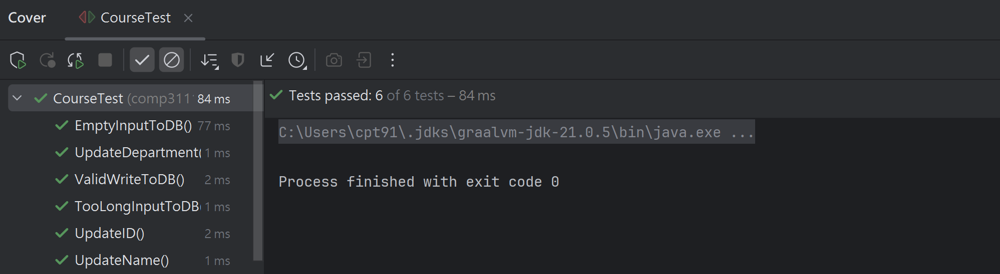
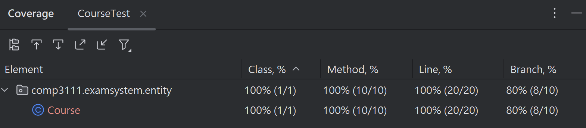

# **Test Report:**


# **Test Coverage:**


# **Source Code:**
```java
package comp3111.examsystem.entity;

import org.junit.jupiter.api.Test;
import static org.junit.jupiter.api.Assertions.*;

class CourseTest {
    @Test
    public void UpdateID(){
        Course Test = new Course();
        Test.setCourseId("COMP2333");

        String expected = "COMP2333";
        String actual = Test.getCourseID();

        assertEquals(expected, actual);
    }

    @Test
    public void UpdateName(){
        Course Test = new Course();
        Test.setCourseName(":(");

        String expected = ":(";
        String actual = Test.getCourseName();

        assertEquals(expected, actual);
    }

    @Test
    public void UpdateDepartment(){
        Course Test = new Course();
        Test.setDepartment(User.DEPARTMENT.COMP);

        User.DEPARTMENT expected = User.DEPARTMENT.COMP;
        User.DEPARTMENT actual = Test.getDepartment();

        assertEquals(expected, actual);
    }

    @Test
    public void ValidWriteToDB(){
        Course Test = new Course("COMP1234",
                                 ":D",
                                 User.DEPARTMENT.COMP);

        boolean expected = true;
        boolean actual = Test.writeToDB();

        assertEquals(expected, actual);
    }

    @Test
    public void EmptyInputToDB(){
        Course Test = new Course("COMP9999",
                                 "",
                                  User.DEPARTMENT.COMP);

        boolean expected = false;
        boolean actual = Test.writeToDB();

        assertEquals(expected, actual);
    }

    @Test
    public void TooLongInputToDB(){
        Course Test = new Course("A++++++++++",
                                 ":/",
                                  User.DEPARTMENT.COMP);

        boolean expected = false;
        boolean actual = Test.writeToDB();

        assertEquals(expected, actual);
    }
}
```